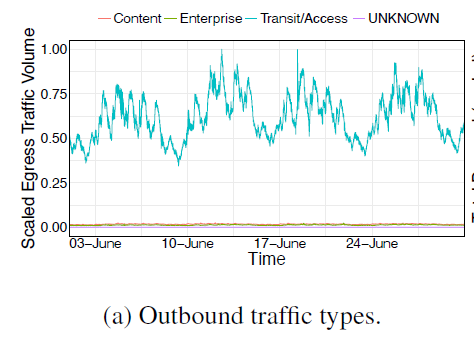
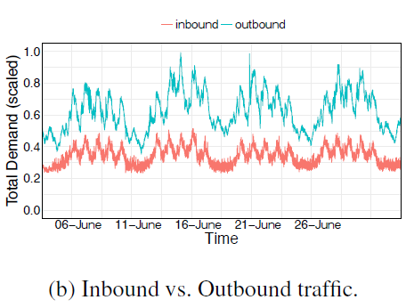
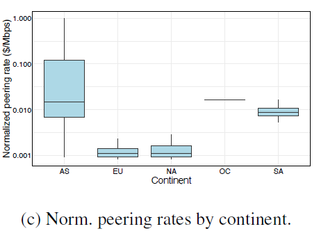

CASCARA：

1. 从大型云提供商到不同类型BGP对等点的出站流量；大部分出站流量流向transit/Access网络。

2. 出战流量大于入站流量

3. 世界不同地区的单位带宽成本差异很大，例如，亚洲的平均对等成本是北美平均对等成本的10倍以上。仅与三家互联网服务提供商的链接贡献了大部分成本。由于对等费率的巨大差异和流量向北美云端地区的几个大型ISP的倾斜分布，三个大型网络的边缘链路在北美的域间带宽上花费了大部分。

这三家ISP分别与北美数十个地点的云提供商进行对等，在云网络和这三家ISP之间建立了**56**条对等链路。我们为不同的对等链路集求解算法1：首先考虑与ISP-1的链路和通过与ISP-1的链路得到服务的出口需求（dj）。同样，我们以ISP-2、ISP-3、ISP-1和ISP-2以及ISP-1、ISP-2和ISP-3的链接和需求作为输入来解决问题实例。

1，3减少了链路，2减少了上行流量和下行流量

减少离线问题求解时间：使用两种技术来限制求解器的时间。首先，使用有效可计算的LP松弛，我们计算MIP解与理论下限的接近度。其次，我们配置分枝定界算法，在经过固定时间后返回当前最佳可行解。如果MIP的当前最佳可行解在LP最优解的15%以内，或者如果解算器已运行15小时，我们将解算器配置为停止。

一种有效加速优化的策略使用上月的决策变量值作为下月模型的相应决策变量的初始值。

华为场景的数据分析：

1. 总上行流量和下行流量：

​	avg(下行) = avg(上行)*1.77

但在有两个site中的中的上行流量会高于下行流量

有不满足比例情况的，但流量较低，是否可以忽略

2. 三个app流量趋势很类似，只是数值不一样，且周期性较为明显。但这个应用组太少，不清楚是否所有应用都这样

​	离线算法或许可以考虑周期性

3. 

问题：

1. 按照场景图，latency=RDC-MPLS0 + 0-MPLS0 ？但这样的话好像latency满足不了app需求
2. 同一个app的流量需求可否由其他site满足，总而减少某些site对应的链路费用

跑一下负载分担和贪心
